效果展示

容器有更新时会提示，能够展示容器状态。可以点击更新实现一键更新，一键替换容器镜像

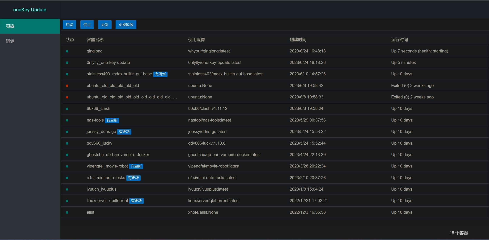

可以删除镜像，标记未使用的镜像

------

1. 拉取镜像

依次打开极空间客户端，docker，镜像，自定义拉取，x86镜像使用`0nlylty/one-key-update:latest`，arm64机器使用`0nlylty/one-key-update:arm64`

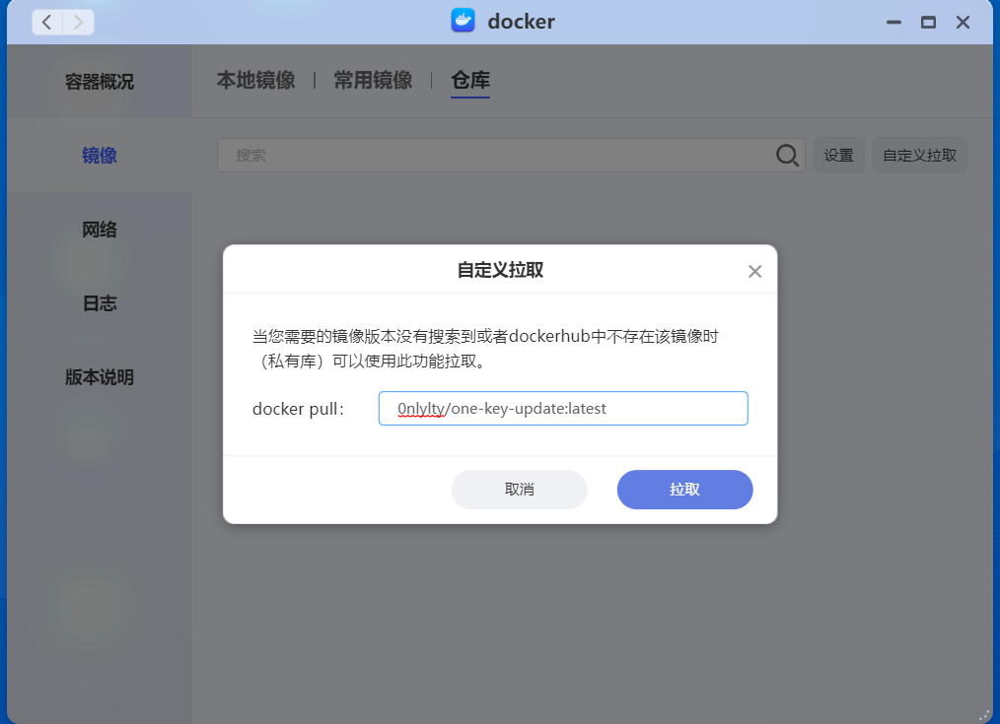

等待下载完成。镜像拉取中出现如下提示可以直接忽略，点击取消即可。

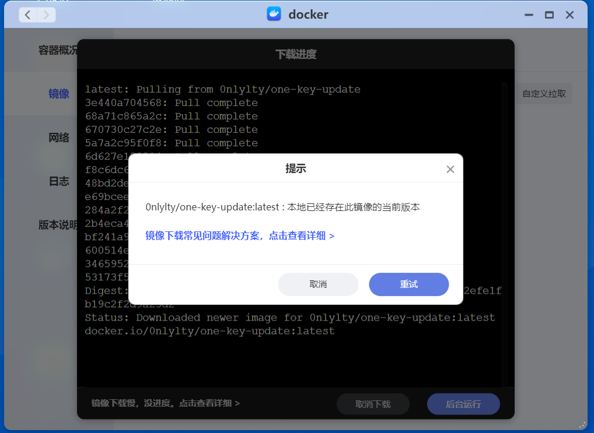

2. 创建容器

在本地镜像中找到刚刚下载的镜像

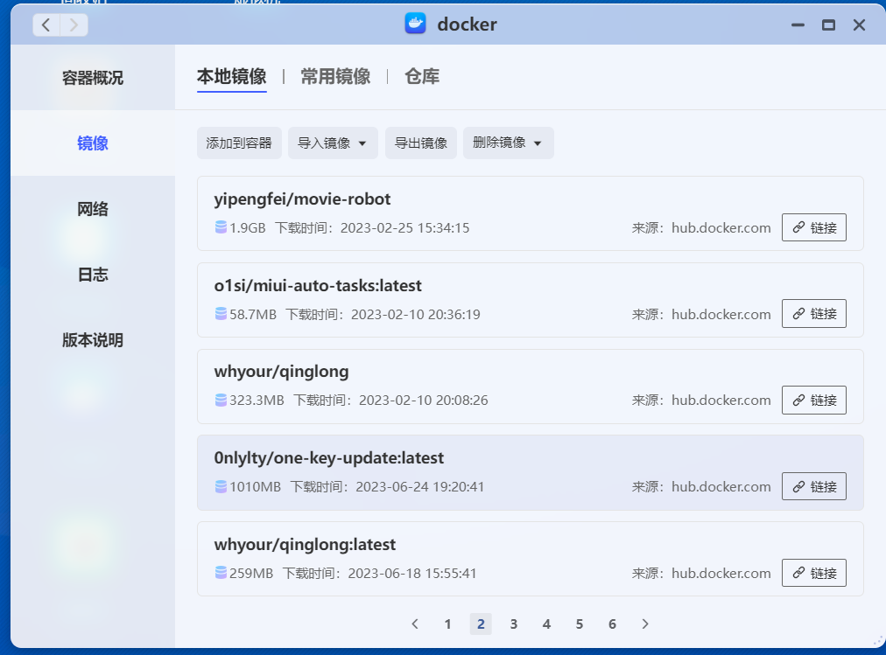

点击添加到容器，我们需要设置两个地方

第一处，网络，更换为host模式，注意必须要为host模式

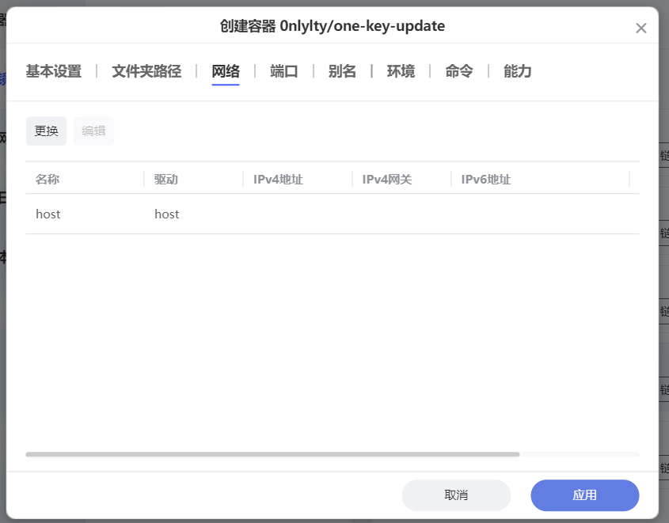

第二处，环境，需要设置account和SECRET_KEY，account填写你极空间的管理员账号，账号一般是电话号码，如果有字母的请把字母也带上，SECRET_KEY这个可以自行设置，这个是等下登录验证时使用。

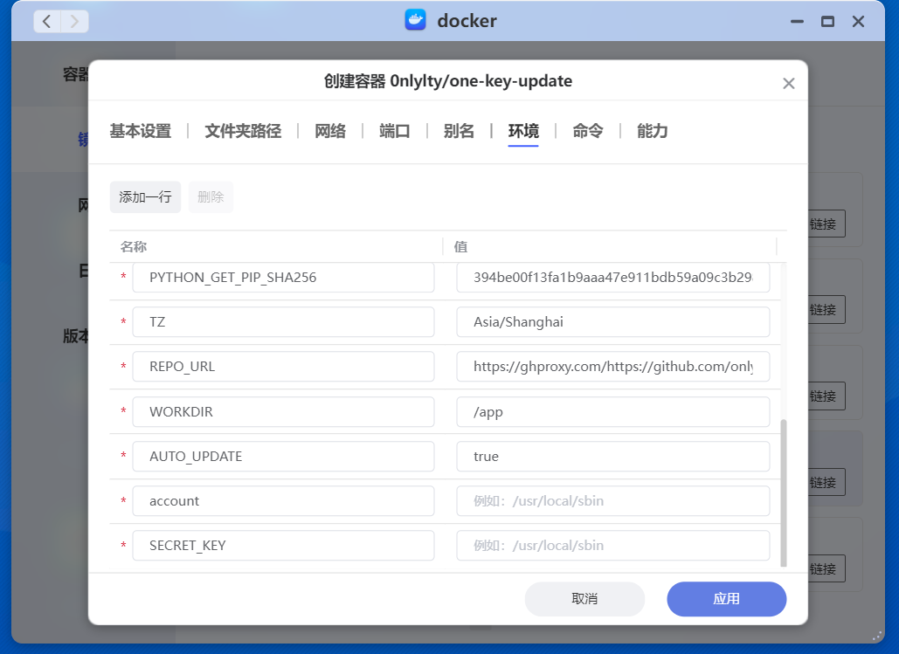

完成后点击应用即可

3. 访问

访问地址为极空间ip:12712。注意：请勿使用极空间的远程访问来访问

比如我的极空间ip为192.168.31.50，那么就访问192.168.31.50:12712即可

登录验证，填写刚刚在环境中填写的SECRET_KEY的值即可

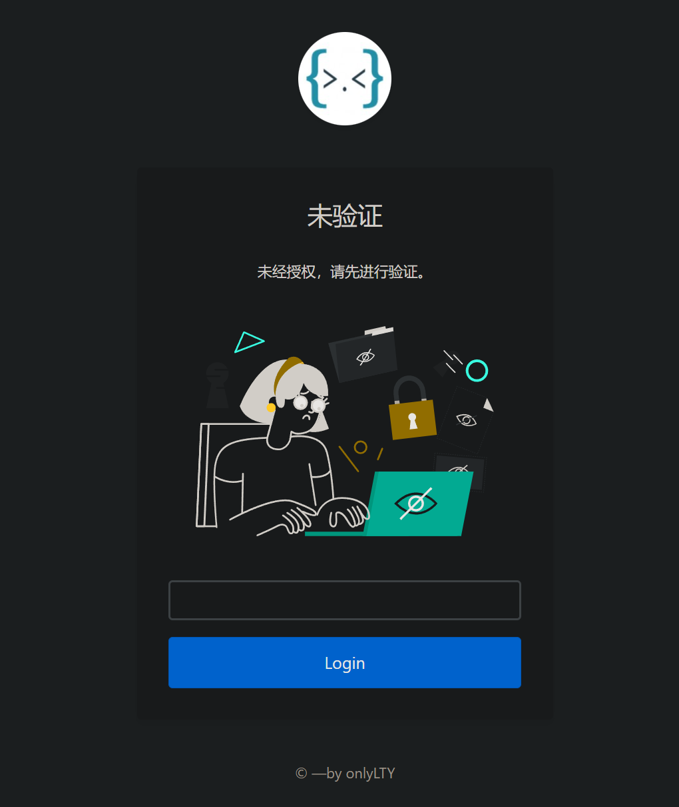

4. 使用更新功能

因为查询数据需要时间，第一次打开可能不会显示哪些容器有更新，可以稍微等几分钟。

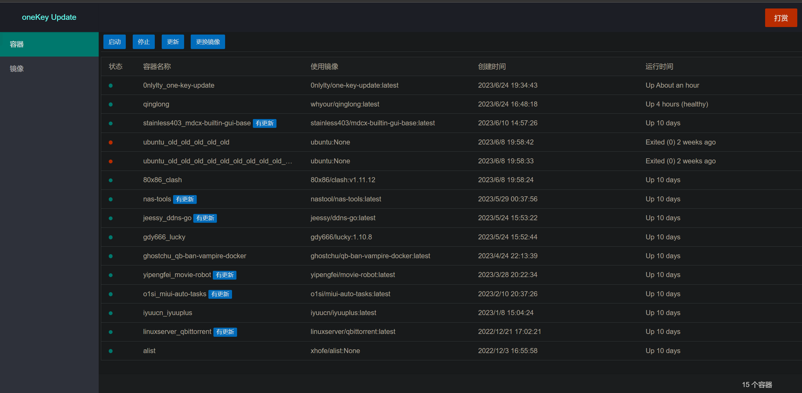

更新容器方式，选中想要更新的容器，点击更新即可

更新中会有这样的提示，请耐心等待

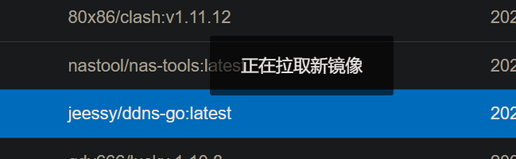

更新完成后会有如下提示，如果不需要保留旧版本可以点击是删除旧版本，如果需要保留请点击否，原容器名_old的即为旧版本容器

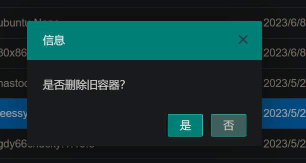

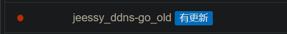

后续可以手动删除

5. 使用替换镜像功能

输入要替换为的镜像名:tag即可，使用这个功能请确定你知道你在做什么。数据丢失本人概不负责。填写类似`0nlylty/one-key-update:latest`即可

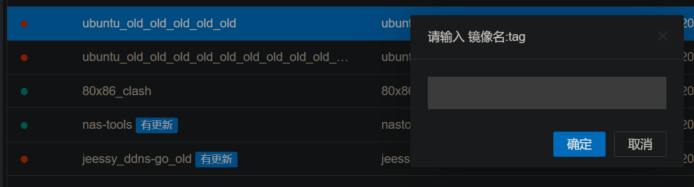