

----

首先，我们打开绿联客户端的设备管理，点到调试功能，打开调试功能会看到如下画面

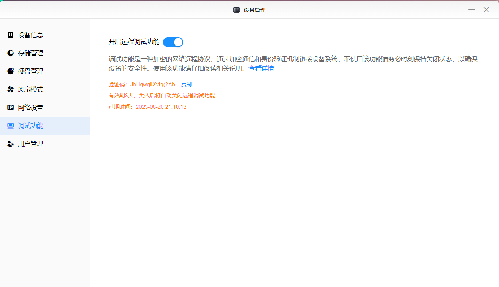

复制验证码

windows可以用 win+r输入cmd打开终端

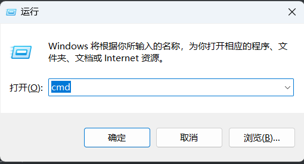

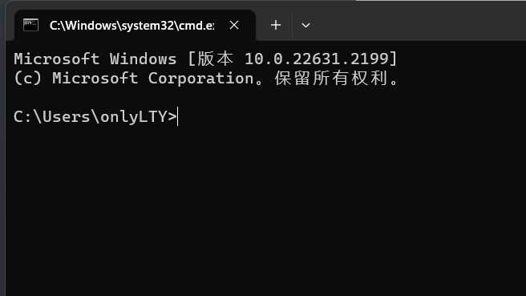

mac可以直接在**启动台**在搜索栏中键入**终端**，打开终端

输入命令 `ssh -p 922 root@绿联的ip`注意ip目前仅能时使用ipv4的ip

这里，比如我的绿联ip是192.168.31.183，则我输入的命令如图

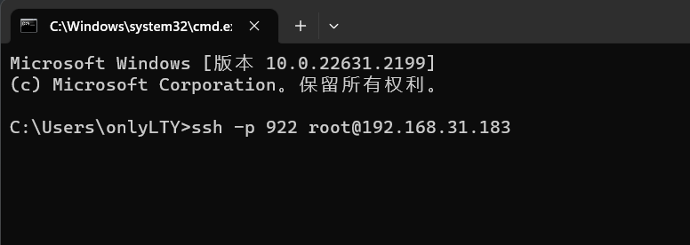

这种输入的话输入yes就好了

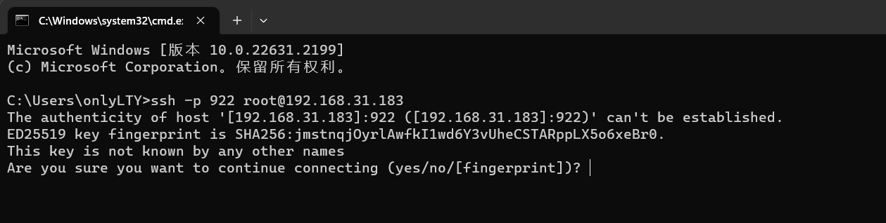

在这里输入刚刚在绿联客户端拿到的验证码，注意，这里的输入是不会显示的，请一次输入正确然后回车

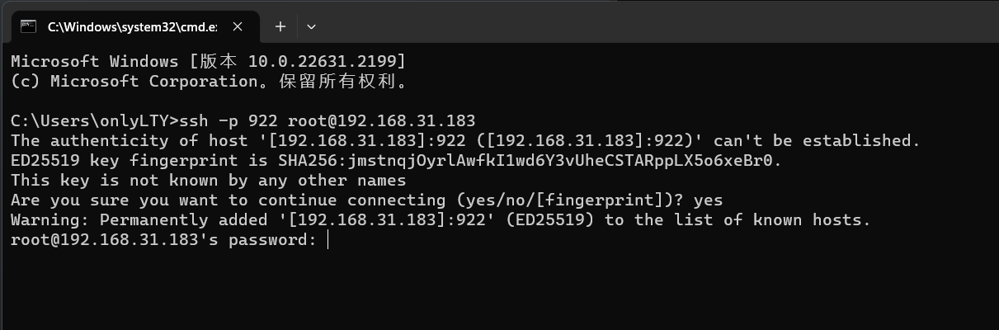

登录成功后会有如下提示

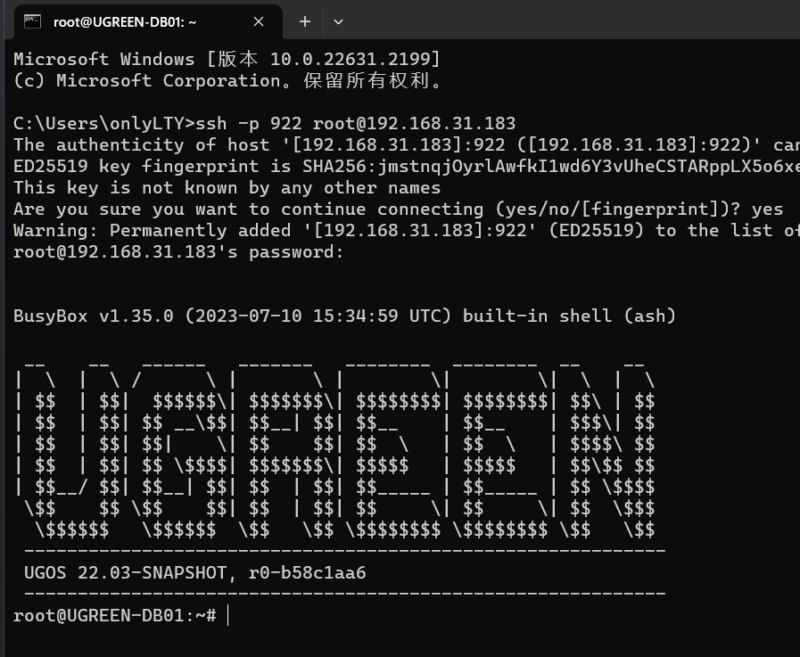

这里输入我们的安装命令`docker run -d --privileged -p 12712:12712 -e secretKey=自己设置访问密码 -e hubURL=https://docker.nju.edu.cn  -v /var/run/docker.sock:/var/run/docker.sock -v 保存数据的目录:/data --restart=always --name onekey 0nlylty/one-key-update:UGREEN` 比如我设置的密码是123，则可以这样输入
注意：请勿随意替换hubURL，如果要替换，请确保能获取到manifests，否则会导致检查更新出现异常

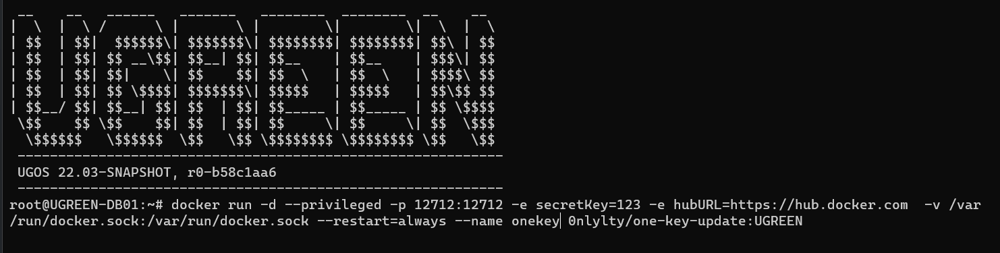

这样的提示就算是安装成功了，f38开头的这行肯定会和这里显示的不一样，不用在意

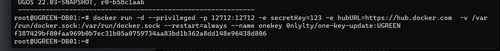

就可以在浏览器访问ip:12712端口了，这里输入你刚刚设置的密码，点击login

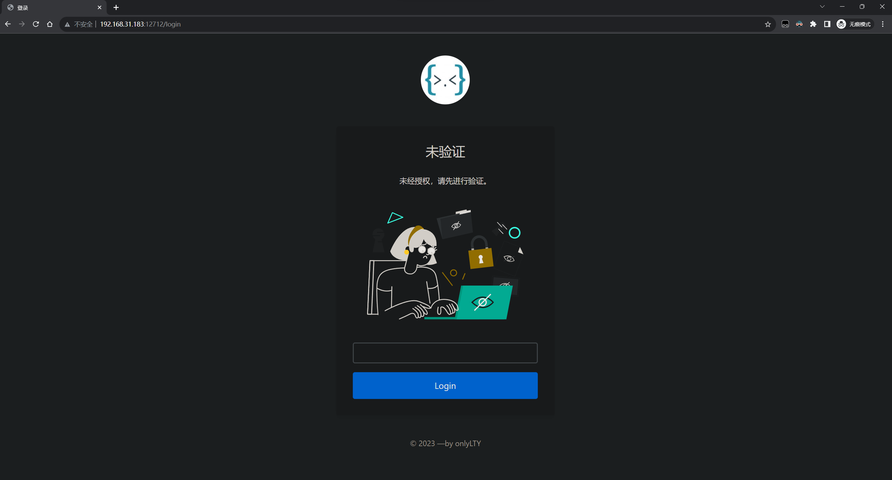

会自动检查镜像是否存在更新，当然，可能有bug，如果更新后还显示有更新的话就无视他就好

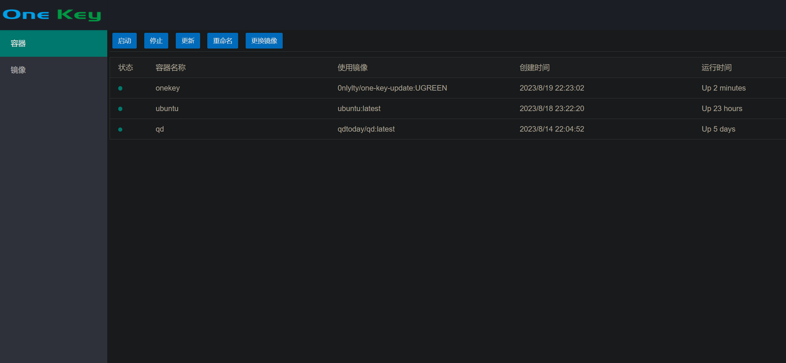

这样就是检测到有更新的

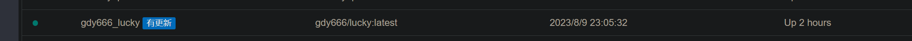

需要更新容器的话就可以点击容器，然后点击更新按钮。会询问是否使用代理，如果镜像拉不下来可以试试使用代理

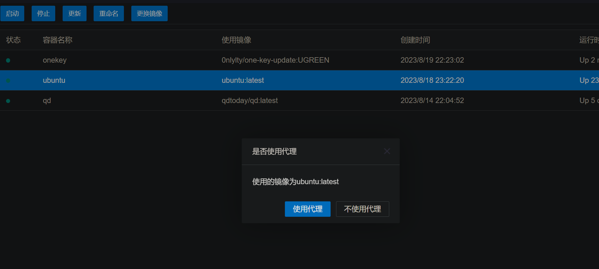

更新完成后会有个弹窗询问是否删除旧容器，这时候可以先不着急点，先去看看更新后的容器是否能正常运行，能正常运行的话，可以点击删除旧容器

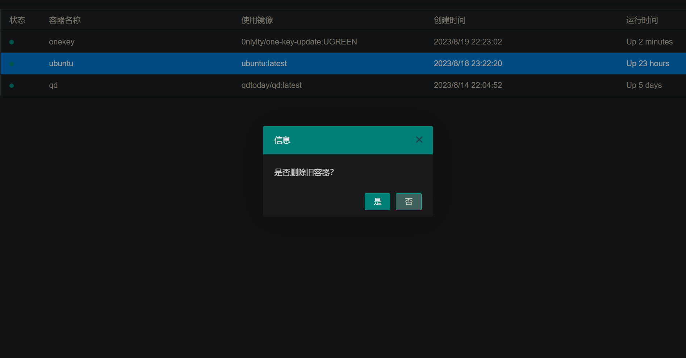

假如，我想更换qd这个容器所用的镜像，从qdtoday/qd:latest版本切换到qdtoday/qd:ja3-dev，那么我可以，使用更换镜像，输入要切换的版本，点击确定即可

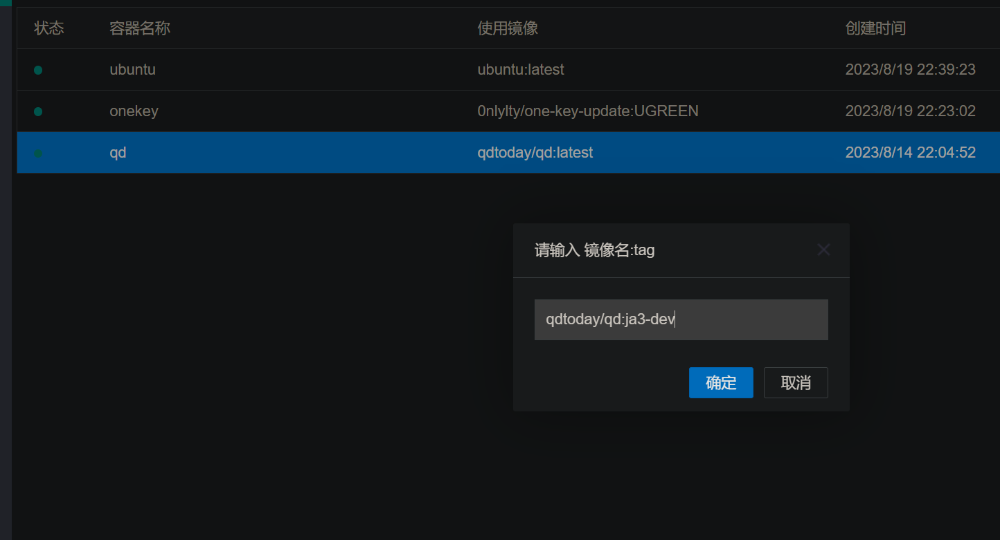

在镜像管理页面，会把没有在使用的镜像标记出来，方便管理

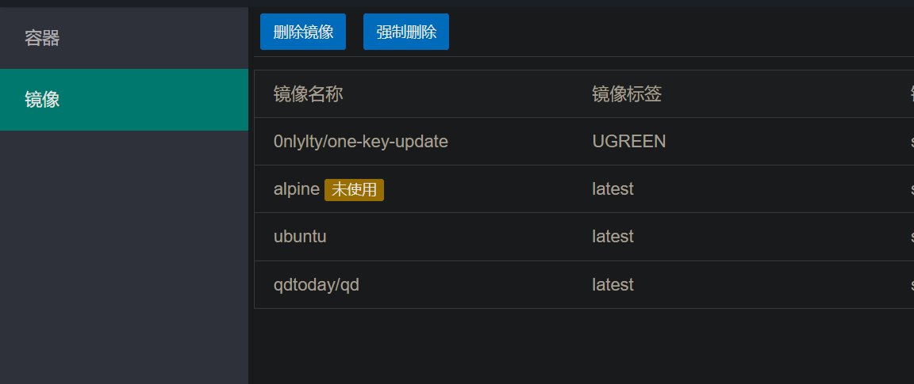

---

# 赞助商

